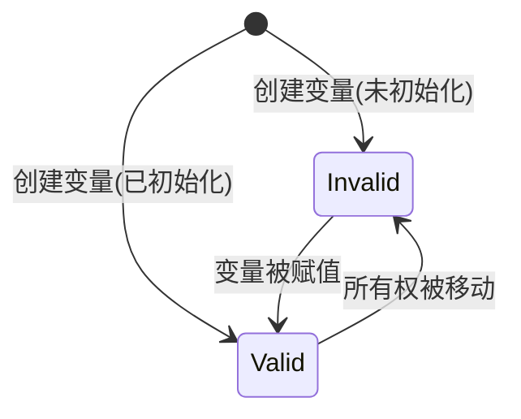

# yian 语法介绍

基本元素:

- **标识符**: 在 C 语言中合法的标识符在 yian 中也是合法的, 除了单独的下划线 `_`
- **访问限定符**: 只能为 `pub`, 表示该成员或函数是公开的, 如果没有指定访问限定符, 则默认为 `private`

## `import` 语法

基本语法:

```text
import 模块路径 [as 别名]
from 模块路径 import 成员1 [, 成员2, ...] [as 别名]
```

以下例子都是合法的:

```text
import xx.yy.zz       // 从模块路径 xx.yy 导入对象 zz
from xx.yy import zz  // 同上

import xx.yy.zz as my_zz        // 从模块路径 xx.yy 导入对象 zz, 其在当前模块中的名字为 my_zz
from xx.yy import zz as my_zz   // 同上

from xx.yy import zz, aa, bb    // 从模块路径 xx.yy 导入对象 zz, aa, bb
from xx.yy import (zz, aa, bb)  // 同上, 使用括号包围成员列表
from xx.yy import (             // 同上, 使用多行语法
  zz,
  aa,
  bb,
)
```

目前以下实体可以作为对象被导入:

- 自定义类型(结构体, 枚举, trait)
- 函数(暂未实现)
- 全局变量(暂未实现)

## 字面量

### 整数字面量

- 十进制: 如 `123`
- 十六进制: 以 `0x` 或者 `0X` 开头, 如 `0x7B`, 字母可以大写或小写
- 八进制: 以 `0o` 或者 `0O` 开头, 如 `0o173`
- 二进制: 以 `0b` 或者 `0B` 开头, 如 `0b01111011`
- 字节字面量: 以 `b` 开头, 用于指代一个 `u8` 值的字符, 如 `b'A'` 表示 `65`, 字符必须是单个 ASCII 字符, 也允许使用 `\x` 开头的十六进制转义序列, 如 `b'\x41'` 也表示 `65`

除了字节字面量外, 整数字面量可以通过在字面量后添加类型后缀来指定类型, 如 `123i32`, `0x7Bu64`

除了字节字面量外, 可以在整数字面量中使用下划线 `_` 来分隔数字, 以提高可读性, 如 `1_000_000`

不存在负数字面量, 负号 `-` 被视为一元运算符

字面量的类型会根据上下文进行推断(暂未实现), 没有足够上下文时, 默认为 `i32`

### 浮点数字面量

- 小数点表示法: 如 `3.14`, `0.001`, 小数点前后都必须有数字
- 科学计数法: 如 `1.23e4`, `5.67E-8`, `e` 或 `E` 后面必须跟一个整数指数, 表示乘以 10 的指数次方
- 十六进制表示法: 以 `0x` 或 `0X` 开头, 如 `0x1.91eb86p+1`, `p` 或 `P` 后面必须跟一个整数指数, 表示乘以 2 的指数次方

浮点数字面量可以通过在字面量后添加类型后缀来指定类型, 如 `3.14f32`, `2.71f64`

浮点数字面量中也可以使用下划线 `_` 来分隔数字, 以提高可读性, 如 `3.14_15_92`

不存在负浮点数字面量, 负号 `-` 被视为一元运算符

字面量的类型会根据上下文进行推断(暂未实现), 没有足够上下文时, 默认为 `f64`

### 字符字面量

字符字面量以单引号 `'` 包围, 如 `'a'`, `'中'`, 中间必须是单个 Unicode 字符, 允许使用转义序列

字符字面量的类型均为 `char`

#### 转义序列

1. 基本转义序列:
   - `\n`: 换行符
   - `\r`: 回车符
   - `\t`: 制表符
   - `\\`: 反斜杠
   - `\'`: 单引号, 在字符串字面量中也可以直接使用
   - `\"`: 双引号, 在字符字面量中也可以直接使用
   - `\0`: 空字符
2. 以 `\x` 开头的十六进制字节转义序列, 如 `\x41` 表示字符 `A`, 注意: 十六进制数字只有两位, 必须对应一个合法的 Unicode 字符
3. 以 `\u{}` 包围的 Unicode 码点转义序列, 如 `\u{4E2D}` 表示字符 `中`

### 字符串字面量

字符串字面量以双引号 `"` 包围, 如 `"Hello, world!"`, 内部可以包含任意数量的 Unicode 字符, 允许使用转义序列(见[转义序列](#转义序列))

字符串字面量的类型均为 `str`

在字符串前面加上前缀 `b` 可以表示一个 `u8` 数组字面量, 如 `b"Hello"` 表示一个 `u8[5]` 类型的数组(暂未支持)

### 布尔字面量

布尔字面量有两个取值: `true` 和 `false`

布尔字面量的类型均为 `bool`

### 数组字面量

数组字面量以方括号 `[]` 包围, 元素之间用逗号 `,` 分隔, 如 `[1, 2, 3]`, 元素类型必须一致. 数组字面量的类型为 `T[N]`, 其中 `T` 为元素类型, `N` 为元素数量, 如上例的类型为 `i32[3]`

(暂未实现)允许使用变量来初始化数组中的元素, 如 `[x, x + 1, x + 2]`, 初始化时, 元素将被**移动**到数组中

(暂未实现)允许使用重复元素的语法来初始化数组, 如 `[0; 5]` 表示一个包含 5 个元素, 每个元素均为 `0` 的数组, 其中元素可以是变量, 但长度必须为常量

### 元组字面量(未实现)

元组字面量以圆括号 `()` 包围, 元素之间用逗号 `,` 分隔, 如 `(1, true, 'a')`, 元素类型可以不一致. 元组字面量的类型为 `(T1, T2, ...)`, 其中 `T1, T2,...` 分别为各个元素的类型, 如上例的类型为 `(i32, bool, char)`

允许使用单元素元组, 如 `(42,)`, 注意: 单元素元组必须在元素后面加上逗号 `,`, 否则会被视为普通的括号表达式

允许使用变量来初始化元组中的元素, 如 `(x, y + 1, z * 2)`, 初始化时, 元素将被**移动**到元组中

## 变量声明

变量声明的格式:

```text
[访问限定符] [类型] 变量名 [= 初始化表达式]
```

- 类型: 可选
  - 如果没有指定类型, 则会根据初始化表达式的类型来推断变量的类型
  - *目前不建议省略类型, 因为这个功能未经充分的测试, 可能有 bug*
  - 注意: 在省略类型的情况下, 赋值和声明的语法一致, *赋值时写错变量名可能导致声明一个新变量而非给已有的变量赋值*, 编译器无法检查出这种错误, 请务必检查变量名的拼写是否正确!
- 变量名: 必须是一个合法的标识符
- 初始化表达式: 可选
  - 任何变量在使用前, 必须初始化
  - 全局变量必须在声明时初始化

## 函数定义

函数定义的格式:

```text
[访问限定符] [返回类型] 函数名[泛型列表]([参数列表]) {
  [函数体]
}
```

- 返回类型: 返回 `void` 时, 必须省略, 否则不可省略
- 函数名: 必须是一个合法的标识符
- 泛型列表: 声明方式为: `<T1, T2,...>`, 其中 `T1, T2,...` 为泛型参数的名字, 必须是一个合法的标识符
- 参数列表: 可选
  - 参数的格式为: `[类型] 参数名`
  - 多个参数之间用 `,` 分隔
  - 不支持可变参数
- 函数体: 包含若干的**语句**
- *不允许在函数内部嵌套定义函数*

## 函数声明

函数声明的格式:

```text
[访问限定符] [返回类型] 函数名[泛型列表]([参数列表]);
```

- 相当于没有函数体的函数定义
- 函数声明**目前**只能出现在 `trait` 中

## 分级指针

yian标准库提供 3 个层级的指针：

- `FullPtr<T>`: 三级指针, 保存底层缓冲区地址、偏移量与 key/长度信息. 支持最完整的操作, 包括指针算术、索引访问、解引用、重新分配和复制
- `Ptr<T>`: 二级指针, 省略了偏移字段, 适合直接指向数组/对象的起始位置, 操作接口与 `FullPtr<T>` 相似但更轻量
- `RawPtr<T>`: 一级指针, 直接携带 `T*` 与 key/长度, 仅做极简封装, 常用于与底层内存交互等性能要求高的场景

所有层级都共享一套内存块头部 `MemoryBlock { u64 lock; u64 size; }`。

- 对于堆指针, `address` 字段指向 `MemoryBlock`, 实际数据位于该结构体后方；对于栈指针, `address` 直接指向变量本身
- `key_or_len` 的最高位用于区分栈/堆: 0 表示栈, 1 表示堆。栈指针时, `key_or_len` 存储字节长度; 堆指针时, 存储随机生成的 key, 并同时写入 `MemoryBlock.lock`, 通过 `__key_lock_match()` 校验

### 使用约定

非标准库中不允许创建裸指针

- `i32* p;`：创建一级指针
- `i32@ p;`：创建二级指针
- `i32 full@ p;`：创建三级指针

## if 语句

```text
if 条件表达式 {
  [若干语句]
} [elif 条件表达式] {
  [若干语句]
} [else] {
  [若干语句]
}
```

- 条件表达式: 必须是一个表达式, 并且类型为 `bool`
- elif: 可选
- else: 可选

## for 循环(未来将会移除!)

```text
for 初始化语句; 条件表达式; 迭代语句 {
  [若干语句]
}
```

- 条件表达式: 必须是一个表达式, 并且类型为 `bool`

## while 循环

```text
while 条件表达式 {
  [若干语句]
}
```

- 条件表达式: 必须是一个表达式, 并且类型为 `bool`

## loop 循环

```text
loop {
  [若干语句]
}
```

除非在循环体内使用 `break` 语句跳出循环, 否则该循环将无限执行下去

可以通过在 `break` 语句后面添加一个表达式来指定循环的返回值(暂未实现)

## for in 循环

for in 语句有两种格式:

```text
// 移动语义的迭代
for 变量名 in 可迭代对象 {
  [若干语句]
}

// 引用语义的迭代
for *变量名 in 可迭代对象 {
  [若干语句]
}
```

- 可迭代对象: 实现了 `Iterable` trait 的对象(见[迭代器](#迭代器))

### 移动语义的迭代

在每次迭代中, 可迭代对象的下一个元素将被**移动**到变量名所表示的变量中. 迭代结束后, 可迭代对象将被标记为无效(见[变量有效性](#变量有效性))

### 引用语义的迭代

在每次迭代中, 可迭代对象的下一个元素的引用(指针)将被赋值给变量名所表示的变量. 迭代结束后, 可迭代对象仍然保持有效

## match 语句

match 语句有两种格式:

```text
// 移动语义的 match
match 条件表达式 {
  分支1: [若干语句]
  分支2: [若干语句]
  ...
  _: [若干语句]
}

// 引用语义的 match
match *条件表达式 {
  分支1: [若干语句]
  分支2: [若干语句]
  ...
  _: [若干语句]
}
```

- 条件表达式: 必须为整数类型, `char` 类型或者枚举类型
- 分支: 如果是条件表达式是枚举类型, 并且对应的变体有负载, 可以使用以下语法提取负载
  - `变体名 as item`: 负载将会被赋值给变量 `item`
- `match` 必须**穷尽匹配**, 也就是说, 条件表达式的所有可能取值都必须对应到某个分支

### 移动语义的 match

在匹配时, 条件表达式的值将被消耗(移动), 并且如果匹配到某个分支具有负载的变体, 该负载也将被移动到对应的变量中. 匹配结束后, 条件表达式将被标记为无效(见[变量有效性](#变量有效性))

### 引用语义的 match

在匹配时, 条件表达式的值不会被消耗(移动), 并且如果匹配到某个分支具有负载的变体, 该负载的引用(指针)将被赋值给对应的变量. 匹配结束后, 条件表达式仍然保持有效

## 赋值

除了使用 `=` 直接进行赋值外, 以下行为也被视为等同于赋值:

- 传入函数参数时, 将实参的值赋值给形参
- 从某个函数返回时, 将返回值赋值给接收返回值的变量
- 声明变量时, 使用初始化表达式指定变量的初始值
- 构造数组或元组字面量时, 将元素的值赋值给数组或元组中的对应位置

赋值默认为移动语义(暂未实现), 对于以下语句:

```text
a = b
```

编译器会做如下处理:

1. 判断变量 `a` 是否有效(见[变量有效性](#变量有效性)), 如果有效, 需要先调用 `a` 的析构函数(见[析构函数](#析构函数))
2. 将变量 `b` 的值移动到变量 `a` 中(即按位复制 `b` 的值到 `a` 中)
3. 将变量 `b` 标记为无效(见[变量有效性](#变量有效性))

### 复制语义的赋值(暂未实现)

对于实现了 `Copy` trait 的类型, 发生赋值时, 不会移动值, 而是进行按位复制. 赋值后, 原变量仍然保持有效.

### 特殊规则

一些特殊的赋值规则:

1. 将字符串字面量赋值给 `str` 类型的变量时, 不会移动字符串字面量的值, 而是创建切片指向字符串字面量的数据
2. 将数组类型的左值赋值给指针类型的变量时, 不会移动数组的值, 而是将数组的地址赋值给指针变量


## 内存管理

yian 通过以下方式申请内存:

- `dyn T`: 申请大小为 `sizeof(T)` 的内存, 返回类型为 `T*`(未来将会移除)
- `dyn T[N]`: 申请大小为 `N * sizeof(T)` 的内存, 返回类型为 `T*`(未来将会移除)
- `dyn expr`: 若 `expr` 的类型为 `T`, 则申请大小为 `sizeof(T)` 的内存, 将 `expr` 的值复制到内存中, 返回类型为 `T*`

通过以下方式释放内存:

- `del ptr`: 释放指针 `ptr` 指向的内存

## 变量有效性



在程序运行到某个点时, 每个此时生命周期内的变量都有一个**有效性状态**, 该状态可以是**有效(Valid)** 或 **无效(Invalid)**. 有效的变量表示该变量目前包含一个合法的值, 可以被正常使用; 无效的变量则相反, 除非被重新赋值, 否则不能被使用.

在程序运行到某个点时, 变量的有效性状态既可以通过编译器的静态分析确定, 也可以在运行时动态记录(使用一个隐藏的布尔变量). 但是有一个例外: **使用**某个变量时, 该变量必须是**静态可确定为有效**的, 也就是说, 沿着任意一个可能的执行路径到达该点时, 该变量都必须是有效的. 否则, 编译器将报错.

## 析构函数

用户自定义析构函数, 用于释放变量占用的**除自身内存以外**的资源, 如动态分配的内存, 文件句柄等.

只有**有效**的变量才会调用析构函数(见[变量有效性](#变量有效性)). 析构函数将在以下情况下被调用:

- 离开作用域时, 变量的析构函数将被自动调用
- 函数返回时, 所有函数参数的析构函数将被自动调用
- 变量被重新赋值时, 被赋值变量的析构函数将被自动调用
- 全局变量的析构函数不会被自动调用

对于聚合了多个元素的类型(如结构体, 枚举, 数组, 元组), 将会先调用自身的析构函数, 然后依次调用各个元素的析构函数.

手动调用析构函数在标准库以外的代码中是不允许的

## 迭代器

待补充

## 文件系统
yian 提供了一套文件系统的基本操作接口，所有的文件操作通过 `File` 对象的方法来实现.

### create_new
```
Result<i64, i64> creat_new(char* pathname)
```
创建一个新的文件, 如果文件已经存在则清空其内容.

### open
```
Result<i64, i64> open(char* pathname, FLAGS flags)
```

打开文件，支持使用`flags`指定打开模式，如果文件不存在,则创建文件.
打开模式请参考 [FLAGS 文件打开模式](#flags-文件打开模式).

### close
```
Result<bool, i64> close()
```
关闭文件, 释放文件句柄.

### read 
```
Result<Vec<u8>, i64> read()
```
从文件中的数据一次性全部读取到一个 `Vec<u8>` 中，返回该`Vec`.

### write

```
Result<i64, i64> write(u8* buf)
```
将 `buf` 指向的内存中的数据写入文件, 最多写入 `buf` 指向的内存大小个字节. 返回实际写入的字节数.


### seek

```
Result<i64, i64> seek(i64 offset, SEEK whence)
```
将文件指针移动到指定位置, `offset` 为偏移量, `whence` 为定位方式. 返回新的文件指针位置.
移动方式请参考 [SEEK 文件指针移动方式](#seek-文件指针移动方式).

### read_to_end
```
Result<i64, i64> read_to_buf(char* buf)
```
读取文件中所有数据, 将文件中的所有数据读取到一个 `u8*` 指针指向的内存空间中

### read_at 
```
Result<i64, i64> read_at(u8* buf, i64 offset, SEEK whence)
```
从文件中的指定位置开始读取数据, 将其存储到 `buf` 指向的内存中, 最多读取 `buf` 指向的内存大小个字节. 返回实际读取的字节数.
`offset` 为偏移量, `whence` 为定位方式. 定位方式请参考 [SEEK 文件指针移动方式](#seek-文件指针移动方式).

### write_at

```
Result<i64, i64> write_at(u8* buf, i64 offset, SEEK whence)
```
将 `buf` 指向的内存中的数据写入文件中的指定位置, 最多写入 `buf` 指向的内存大小个字节. 返回实际写入的字节数.
`offset` 为偏移量, `whence` 为定位方式. 定位方式请参考 [SEEK 文件指针移动方式](#seek-文件指针移动方式).

### FLAGS 文件打开模式

枚举文件操作标志，用于指定文件的打开模式

- `RDONLY`: 只读模式
- `WRONLY`: 只写模式
- `RDWR`: 读写模式
- `CREAT`: 如果文件不存在，则创建文件
- `TRUNC`: 如果文件存在，则截断文件为零长度
- `APPEND`: 追加模式，写入数据时从文件末尾开始

### SEEK 文件指针移动方式

枚举文件指针移动方式，用于指定 `seek` 方法的行为

- `SET`: 从文件开头开始计算偏移量
- `CUR`: 从当前文件指针位置开始计算偏移量
- `END`: 从文件末尾开始计算偏移量


## FFI

yian支持通过FFI调用其他语言的实现

基本语法
```
extern [要调用语言] {
    [若干个函数声明];
    ...
}
```